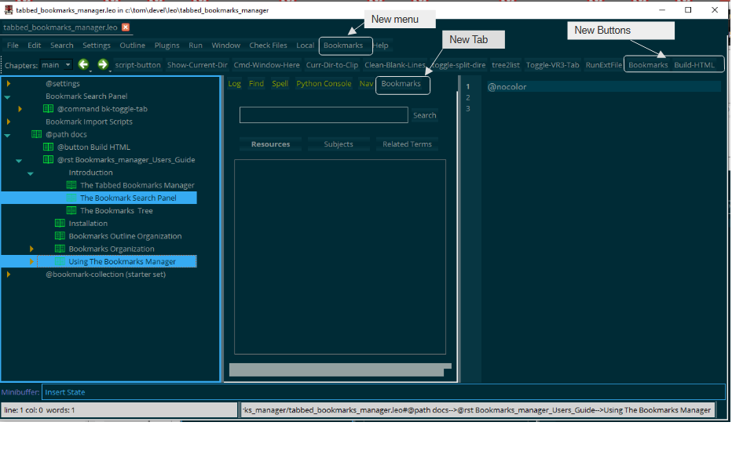
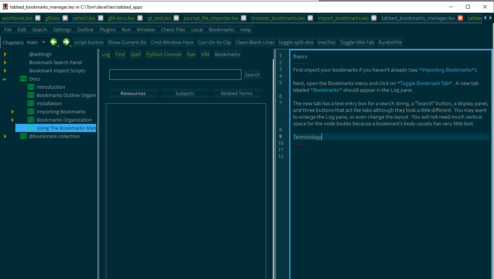
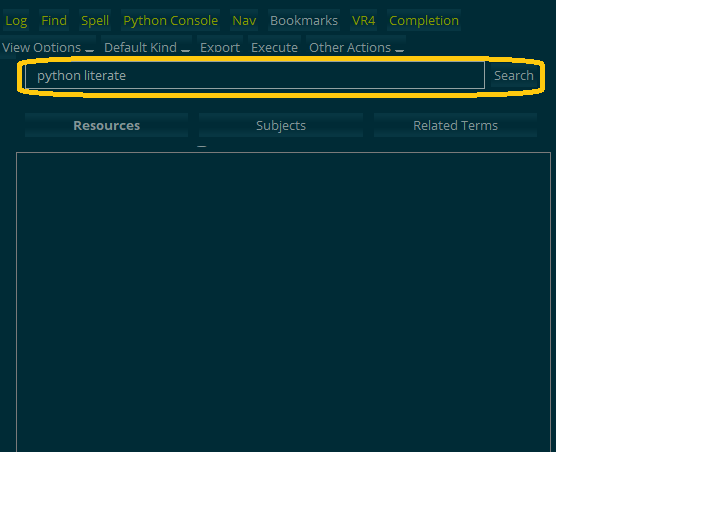
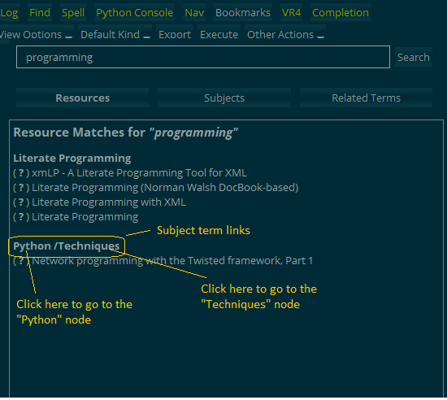
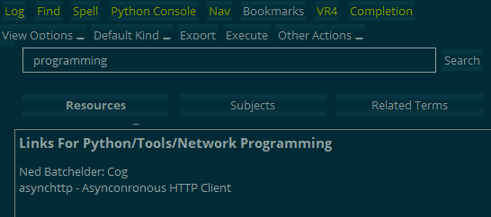
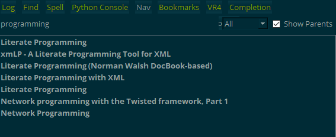
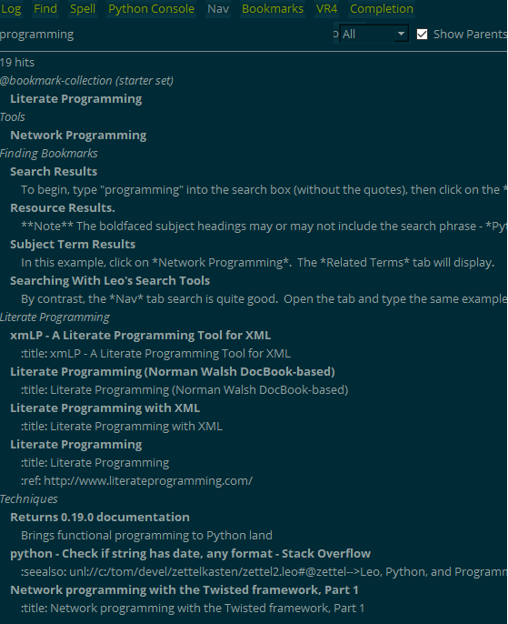
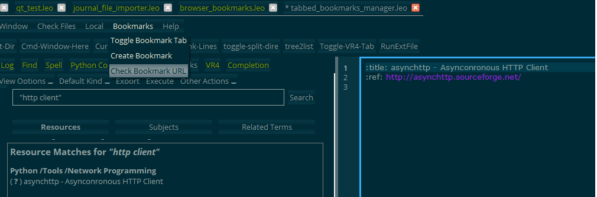

.. rst3: filename: Bookmarks_manager_Users_Guide

:tocdepth: 4

================================
Bookmarks Manager User's Guide
================================

Introduction
++++++++++++

The Tabbed Bookmarks Manager
****************************

The Tabbed Bookmarks Manager (TBM) is a browser bookmarks manager that improves on the bookmark managers that come with web browsers.  It provides

1. Much better abilities for finding bookmarks;
2. Much better ability for organizing and reorganizing your bookmarks, thanks to Leo's tree functionality;
3. A capability for seeing your bookmarks in context;
4. Much better abilities for discovering bookmarks that you had forgotten about;
5. The change to discover a relationship between various bookmarks and their categories that you had not realized.
6. The ability to include bookmarks to files in your file system.
7. The ability to write notes in your bookmark nodes.

The TBM imports your bookmarks from your browser, and also creates new ones when you want to store them.  It has its own GUI, which opens in a new tab in Leo's Log pane.  The TBM has search and display capabilities, and you can also also use Leo's own search and tree organization commands.

The TBM consists of a python script that creates a top-level class, a number of new Leo commands, scripts for importing bookmarks from the browser, and a tree that contains the actual bookmarks.  The entire application is contained within a single Leo outline.

The outline also includes the source for this Sphinx document itself, along with code for re-creating it.

The Bookmark Search Panel
*************************

The node with the headline *Bookmark Search Panel* (BSP) contains the core code for the Bookmark Manager. In combination with a small set of scripts, the BSP provides a browser bookmark manager that displays inside a tab in Leo's Log frame.

When the Bookmarks outline is loaded, it creates a new menu named *Bookmarks* and a new button in the Icon bar also named *Bookmarks*. The new controls are shown in this screenshot of the BSP after activating the bookmarks tab:
    

In addition, the typeface for Leo's body editor changes from mono-spaced to proportional, non-monospaced.  When the *Bookmarks* tab is toggled off again, the typeface changes back to Leo's usual monospaced font [f1]_.

.. [f1]  The font change can be prevented by commenting out a few lines in the script that toggles the *Bookmarks* tab.

The Bookmarks  Tree
*******************

The bookmarks themselves are contained in this outline.  The top of the bookmarks tree must be a top-level node whose headline starts with *@bookmark-collection*.  The bookmark code will use the first node it finds whose headline starts with the identifying string.

Installation
++++++++++++

No installation is necessary.  Just open the bookmark's outline in Leo. 

To open the *Bookmarks* tab, either click the *Bookmarks* button or the *Bookmarks/Toggle Bookmarks Tab* menu item.

Bookmarks Outline Organization
++++++++++++++++++++++++++++++

The bookmark manager scripts, settings, and the actual bookmark collection have this organization::

    browser_bookmarks.leo
        - @settings
            - @menuat before
                - @menu &Bookmarks
                    - @item bk-open-tab
                    - @item bk-create-bookmark
                    - @item bk-chk-url
                - Commands
                    - @command bk-chk-url
                    - @command bk-count
                    - @command bk-create-bookmark
                    - @command bk-delete-tab
                    - @command bk-find-latest
                    - @command bk-open-tab
                    - @command bk-open-docs
        - Bookmark Search Panel
            - @command bk-toggle-tab
        - Bookmark Import Scripts
            - Import JSON Bookmarks File
            - Import Firefox Bookmarks File
        - Docs
                - @button Build HTML
                - @rst Bookmarks_manager_Users_Guide
                    [text source for the User's Guide]
        - @bookmark-collection (starter set)
                [sample organizer nodes and bookmarks]

The bookmark import scripts will create an *@bookmark-collection* subtree at the end of the outline.

Bookmarks Organization
++++++++++++++++++++++

In the browser's bookmark manager, bookmarks are organized as trees, with some nodes being the organizing nodes and the others the actual bookmark records.  After the bookmarks have been imported into your Leo outline, there will be the same organizer and URL nodes in the same order.

Organizer nodes have a headline but normally the body will not contain any text. It is not harmful to have text in their bodies, but the bookmark manager will not make use of it.

URL (or "resource") nodes contain the actual bookmarks.  Their bodies contain at least a title, url, and data as in the following example::

    :title: Leftover Skillet Turkey Pasta
    :ref: https://anitalianinmykitchen.com/turkey-pasta-skillet/
    :date-added: 2022-12-01

The colons around the keywords *title* and *ref* are essential for the bookmark manager code.  They are inserted automatically when new bookmark nodes are created.  You can add any notes you like to the body as long as you leave the :title: and :ref: lines in place (although you can edit their contents).

Example
*******

Here is a fragment from a bookmark tree after import into Leo.  It only shows the headlines::

    Pasta
        Pasta Alla Gricia
            Pasta Alla Gricia Recipe - NYT Cooking
            Salami Pasta Alla Gricia Recipe - NYT Cooking
        Cacio e Pepe
            Cacio e Pepe Recipe - NYT Cooking
            Cacio e Pepe (Spaghetti With Black Pepper and Pecorino Romano) Recipe
            Cacio e Pepe [GEOFFREY ZAKARIAN]
            Farro e Pepe Recipe - NYT Cooking
        Leftover Skillet Turkey Pasta
        A French onion pasta recipe that turns the soup into a one-pot meal - The Washington Post
        Buttery Lemon Pasta With Almonds and Arugula Recipe - NYT Cooking
        Chile Crisp Fettuccine Alfredo With Spinach Recipe - NYT Cooking
        Creamy Asparagus Pasta Recipe - NYT Cooking
        Seared Scallop Pasta With Burst Tomatoes and Herbs Recipe - NYT Cooking
        Crème Fraîche Pasta With Peas and Scallions Recipe - NYT Cooking

Using The Bookmarks Manager
+++++++++++++++++++++++++++

@nocolor

Basics
******

The bookmark manager can help you find resources that you have bookmarked.  At least as important, it can help you find things you had forgotten about (or misplaced). It can help you notice connections between things that you had not realized.

The bookmark manager understands *file:///* URLs, so you can have bookmarks into your file system.  Linked files will get opened by whatever application your OS thinks it should use for that file type.

The bookmark manager understands Leo's *unl:*  links, so you can have bookmarks into Leo outlines.

Getting Started
^^^^^^^^^^^^^^^

If you do not want to experiment with the starter set of bookmarks that came with this outline, then import your bookmarks if you haven't already (see :ref:`Importing Bookmarks`). After a successful import, delete the starter set.  Otherwise walk through the examples in the :ref:`Finding Bookmarks` section before you import them.

**NOTE** - you can import your bookmarks now if you want.  They will be created in a top-level node below the bookmarks supplied with the outline.  The TBM will not find your bookmarks until you delete the starter set or move it below your own imported collection.

Next, open the Bookmarks menu and click on *Toggle Bookmark Tab* [f2]_.  A new tab labeled *Bookmarks* should appear in the Log pane. 

.. [f2] Or click on the *Bookmarks* button.

The new tab has a text entry box for a search string, a "Search" button, a display panel, and three buttons that act like tabs although they look a little different.  You may want to enlarge the Log pane, or even change the layout.  You will not need much vertical space for the node bodies because a bookmark's body usually has very little text.

You can move around the collection using links in the Bookmarks tab, or using Leo's own navigation commands.  You can open a bookmark's URL in a browser, or go to its node.  From a bookmark node, you can open the link using Leo's standard <CTRL-Click> on its URL.

Starter Set Of Bookmarks
~~~~~~~~~~~~~~~~~~~~~~~~

This outline comes with a small collection of bookmarks  that you can use to follow along with the documentation examples.  If you want to do this, don't import your own bookmarks until you go through the section on *Finding Bookmarks*.

The starter set contains some very old bookmarks.  Some of them no longer exist.  They have been left in the starter set because it is useful to see how to check and handle them.

Where are the bookmarks?
~~~~~~~~~~~~~~~~~~~~~~~~

The bookmark collection must be stored as a subtree under a top-level node having a  headline that starts with *@bookmark-collection*.  The bookmark manager will use the **first** node with such a headline.  If you have other top-level nodes starting with *@bookmark-collection* below the first one, TBM will not search them.

Terminology
^^^^^^^^^^^

Resource
~~~~~~~~

A bookmark node normally does not have any children - it is a "leaf" node.  It contains the title and URL of the bookmarked page.  The bookmark manager calls a bookmark node a "resource" node.  This comes from the name _URL_, standing for *Uniform Resource Locator*.  The bookmarked page is the "resource".

A resource node *must* contain a line starting with *:ref:*, followed by a URL.

Subject Term
~~~~~~~~~~~~

Resource nodes are the children of what Leo users tend to call *organizer* nodes.  They usually do not have any content, but their names are hints about what kinds of concepts their children contain.  The headline of one of these nodes is called a *subject Term*.  There are also *compound subject terms*.  These are path expressions that flatten the path to the node.  For example, a hierarchy like this::

    Food
        Fruit
            Apples

would be flattened to `Food/Fruit/Apples`.  This is a compound subject term.  Each step of the path would be considered an *atomic* subject term.  Searches display both the resources and subject terms that are found.

A subject term node *must not* contain a line starting with *:ref:*.  The bookmark manager discovers whether a node is a resource or a subject term node by looking for a line starting with *:ref:*

Leo Layouts
^^^^^^^^^^^

Here is a suggested layout of Leo frames that works well for using the bookmark manager (CTRL-CLICK on the link):

It would be a good idea to save the layout you decide is best.

Importing Bookmarks
^^^^^^^^^^^^^^^^^^^

Import your bookmarks from the browser by using the *bookmarks.json* file that the browser can export.  They can be imported from Firefox and from the Chrome family of browser, which includes Chrome, Vivaldi, Brave and other browsers based on Chrome.

The two kinds of browsers use different json formats, so there are two import scripts.  They are located in the nodes *Import Chrome-family JSON Bookmarks File* and *Import Firefox Bookmarks File*.

To import your bookmarks file, select the right script for your browser type.  In the line near the top of the node, change the path to the bookmarks file to match yours::

    MOZ = r"C:\Users\tom\Downloads\bookmarks-2023-03-27.json"

Then run the script with CTRL-b. A top-level node named *@bookmark-collection* will appear in a second or less.  This is the parent node of your bookmarks.

DO NOT CHANGE THE NAME OF THIS NODE. The bookmarks code finds the bookmarks by looking for a node whose headline starts with *@bookmark-collection*.

If you run the script a second time, a new *@bookmark-collection* subtree will be created after the previous one. This will not be harmful in the sense of damaging data or making the bookmark manager fail to run. But it may be confusing when you use the bookmarks manager.  If you do this, then delete one of the two *@bookmark-collection* nodes.

How To Create The bookmarks.json File
~~~~~~~~~~~~~~~~~~~~~~~~~~~~~~~~~~~~~

The mechanics for exporting bookmarks from the browser differ from one type to another.

Firefox
~~~~~~~

1. Open the bookmarks management dialog using the *Bookmarks/Manage Bookmarks* menu item.
2. In the dialog, select the menu item *Import and Backup/Backup*
3. In the File/save dialog that opened, navigate to the target output directory (usually *Downloads*) and save the file as a *.json* file.

Vivaldi And Other Chrome-Based Browsers
~~~~~~~~~~~~~~~~~~~~~~~~~~~~~~~~~~~~~~~

Vivaldi and other Chrome based browser do not have a menu item to export as JSON.  But they store a bookmark backup file in JSON format.  Normally, this file (on Windows) is *"%USERPROFILE%\AppData\Local\Vivaldi\User Data\Default\Bookmarks"*  On Linux, the file will be *~/.config/vivaldi/Default/Bookmarks*. (It is possible that this location may differ for different Linux distributions).

For other Chrome family browser types, the path is similar but with *vivaldi* replaced by the browser type. For example, the backup JSON file for the Brave browser has its Windows bookmark backup file at *"C:\Users\tom\AppData\Local\BraveSoftware\Brave-Browser\User Data\Default\Bookmarks"*.

Saving A New Bookmark
^^^^^^^^^^^^^^^^^^^^^

To save a new bookmark, copy its address (its URL) to the clipboard.  Navigate to where in the bookmarks collection you want to put it.  Then select the *Bookmarks/Create Bookmark* menu item.  This might take a few seconds if the page is large, since the TBM needs to download and examine the page to find its title.

A new node will be created containing the title, URL, and date.  You may want to use Leo's tree commands to move the new node to the right, depending on whether it was created indented or not.  Later you can move the node around if you decide you want it somewhere else, or you can clone it into some other location if that seems to make sense.

The Bookmark Manager may be unable to find a page's title.  This could happen because of poor page design.  It is not possible for the Bookmark Manager to find the title of a PDF file , and the TBM does not even try to download the file to find its title.

If no title has been found, a dummy title will be used.  You will need to edit the title and headline to change the title to something sensible.

If the string in the clipboard is not a legal URL, the TBM will try to interpret it as the path to a file in the file system.  If this succeeds, a new file:/// bookmark to the file will be created.  The bookmark will be properly URL-quoted and escaped so that it can be opened by the operating system.

Creating A New Bookmark By Hand
^^^^^^^^^^^^^^^^^^^^^^^^^^^^^^^

To create a new bookmark by hand, Create a new Leo node where you want, and add a line starting with *:title:* and another starting with *:ref:*. Type in the title and URL respectively after the two keywords, with a space after the trailing colon (:).

You could do this to create a unl: link into another Leo outline.

Finding Bookmarks
^^^^^^^^^^^^^^^^^

This outline includes a small collection of bookmarks for you to play with and follow along with the examples to come.  Screen shots can be opened by CNTL-CLICKing on their links.  They will open in whatever file association the operating system chooses to use.

Remember that some of these bookmarks are so old that they no longer exist.  This situation will be covered later.

The Search Box
~~~~~~~~~~~~~~

The search box with its button are marked in this image:

Type a word or phrase in the search box.  It will be searched for when you click on the *Search* button or press the <ENTER> key.  The search is not case-sensitive. Normally the TBM will search for each space-separated part of the entry.   So the phrase *python literate* will find hits on both *python* and *literate*.

To search for the phrase as is - verbatim - surround it with double quotes.

Normally the search will find hits if the search phrase is contained in the target.  So "pyth" will also find *pytho*, *python*, and so on.  To make the TBM find matches to the exact string, prefix it with *w:* -

*w:pyth*

This will only find the word *pyth*.  The exact word prefix, *w:* can be combined with double quotes.

Search Results
~~~~~~~~~~~~~~

Two Kinds Of Search Results
---------------------------

There are two kinds of nodes in a bookmark collection: *resources* and *subjects*.  These are described in the *Terminology* section.  A *resource* is a node that contains a URL (or UNL).  A *subject* refers to the concept of *subject terms*, and can either be what is called an *organizing node* in Leo, or a flattened path to one, which is called a *compound term* in the *Terminology* section.

Resources and subjects are searched separately.  Resource results are displayed in the *Resources* tab and subject term results in the *Subjects* tab.

An Search Example
-----------------

To begin, type "programming" into the search box (without the quotes), then click on the *Search* button or press the *<Enter>* key.  The results will look like the linked image:

.. image:: images/search1-resources.png

Notice that the *Resources* tab has been focused.  If there had been no resource hits but only subject hits, the *Subjects* tab would have been focused instead.

Resource Results.
-----------------

The Resource Hits
--------------------
Resource results (the actual bookmarks found) display in a normal typeface, as shown below: 

.. image:: images/search1-resources-1.png

Clicking on the name of a bookmark will open the link in the system browser or, if it is a "file:" url - pointing to a file on the computer - the operating system will open it.

Clicking on the question mark *(?)* will navigate the Leo bookmarks tree to the node for that bookmark. You can make notes, correct typos, or do any other maintenance or editing you want in the body of that node.

The Boldfaced Subject Terms
-------------------------------
The boldfaced lines give the names of the subject terms that the found resources are under.  Notice that one is a simple term and the other is a compound term indicating the flattened hierarchy of the subject terms leading to the resources.  Each step of the boldfaced steps can be clicked on and the tree will navigate to the corresponding node.  This is depicted below:

For example, clicking on "Python" takes you to the top of the *Python* tree, and clicking on *Techniques* takes you to its node - this part of the bookmark tree has the structure::

    - Python
        -Techniques

This structure has been flattened to ``Python/Techniques`` in the search results.

**Note** The boldfaced subject headings may or may not include the search phrase - *Python/Techniques* does not include the phrase *programming*.  This is because the hits displayed here were found by searching resources, not subjects.

Subject Term Results
--------------------

Now select the *Subjects* tab.  There are two results, as shown in this screen shot:

.. image:: images/search1-subjects.png

These results are hits on simple subject nodes that contain the search phrase.  However, there might be several compound  subject terms that match.  Click on one of the results to find out

In this example, click on *Network Programming*.  The *Related Terms* tab will display.

There is only one result (often there will be several), and it shows the full (flattened) location in the bookmarks tree. This screen shot depicts this view of the bookmarks manager after selecting a subject term:

.. image:: images/search1-subjects-1.png

The word *Context* refers to the path to the node, which is considered to be the "context" of the bookmark.  In the future other kinds of relationships may be added.

Click on one of the results (this time there is only one choice).  The display will activate the *Resources tab* and list all the resources (bookmarks) under that organizing node.  These links will open when clicked.  Here is a screenshot:
 

 
In the future, this display will be enhanced to add the *(?)* links to navigate to the actual bookmark's node, and to make each step in the "Links For" path clickable.

Searching With Leo's Search Tools
~~~~~~~~~~~~~~~~~~~~~~~~~~~~~~~~~

You can also search the bookmark collection using Leo's own tools.  Let's compare the results with those of the bookmark manager's own searches.

Leo's *Find* tab presents hits one at a time, and this is usually not very helpful because it's usually important to be able to scan through a range of similar hits.  Stepping through one by one is not so helpful.  There is also the *find-all* command but its listing is hard to read, and ungrouped.

By contrast, the *Nav* tab search is quite good.  Open the tab and type the same example search phrase, "programming".  Do not press the <ENTER> key yet.  Here is a screen shot of the results:

The Nav tab shows headlines of all nodes that matched the search phrase, whether they are bookmarks or subject terms.  Compare with the bookmark manager's Resource tab display:

.. image:: images/search1-resources.png

Next, press the <ENTER> key in the Nav pane. The result is a listing of body lines that match, listed under their headlines in boldface, and all grouped under their nearest organizing node.  Here is a screenshot:

These results are fairly useful.  To open a bookmark, we click on its link in the Nav tab to navigate to its node. Then in its node we <CTRL-CLICK> on the URL in the "ref" line to open it.

Although this is a useful display, the bookmark manager offers these improvements:

    - A less cluttered, more targeted display;
    - Clicking opens the resource in the browser;
    - Harder to navigate to the organizing nodes;
    - Hard to find related subject terms;
    - Harder to scan for results of interest;
    - Harder to notice unexpected results and relationships.

A search using the Nav panel will also find hits in the bookmark code, scripts, and this documentation material, even though they are not part of the bookmarks collection.

Broken Bookmarks
^^^^^^^^^^^^^^^^

Some bookmarks become unavailable, especially older ones.  Here is how to deal with them.

A bookmark may not work because it now uses an *https* URL instead of the original *http* protocol.  To see if this is the case, navigate to the bookmark's node and add an "s" to the "http". TBM has a command to test a bookmark, *bk-chk-url*.  This command can be run from the *Bookmarks/Check Bookmark* URL menu item. This is shown in the screenshot:

If changing to *https* does not work, then the page might have moved.  You will have to do internet searches to find it.  If you do, you can just edit the URL in the body of the bookmark's node.  Otherwise you might just as well delete the node.

Commands
^^^^^^^^

The bookmark manager installs some commands that are specific to the bookmark outline.  Their names all start with *bk-*, so that you can list them all using minibuffer tab completion.  Enter the minibuffer with <CTRL-x> or by clicking in it.  Type "bk-", then press the <TAB> key.

Here are the commands:

    1. bk-chk-url -- check a bookmark's URL.  Available from the *Bookmarks* menu.
    2. bk-count -- count the bookmarks and subject terms.  Displays counts in the Log pane.
    3.    bk-create-bookmark -- Create a new bookmark node at the selected tree position.  Available from the *Bookmarks* menu.
    4. bk-delete-tab -- close the Bookmarks tab.  It can be reopened, and will keep its state.
    5. bk-open-tab -- Open the Bookmark tab if close, close it if open. 
    6. bk-find-latest -- list the 30 most recent added bookmarks in the Log pane.
    7. bk-open-docs -- Open the Sphinx User's Guide in the browser.

